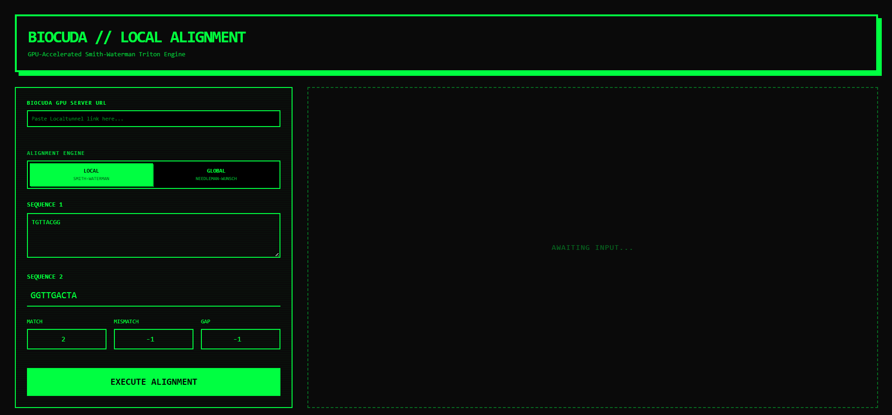
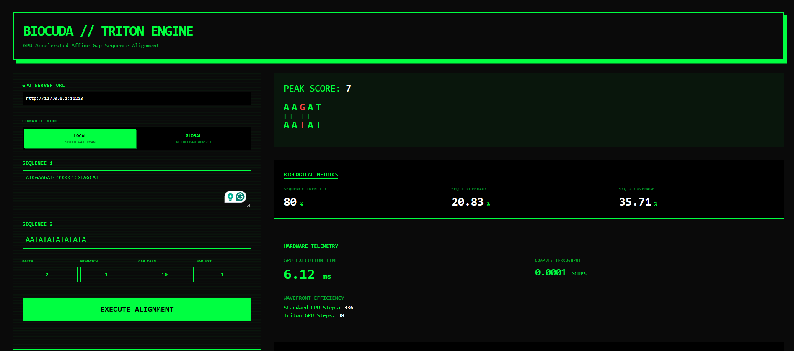
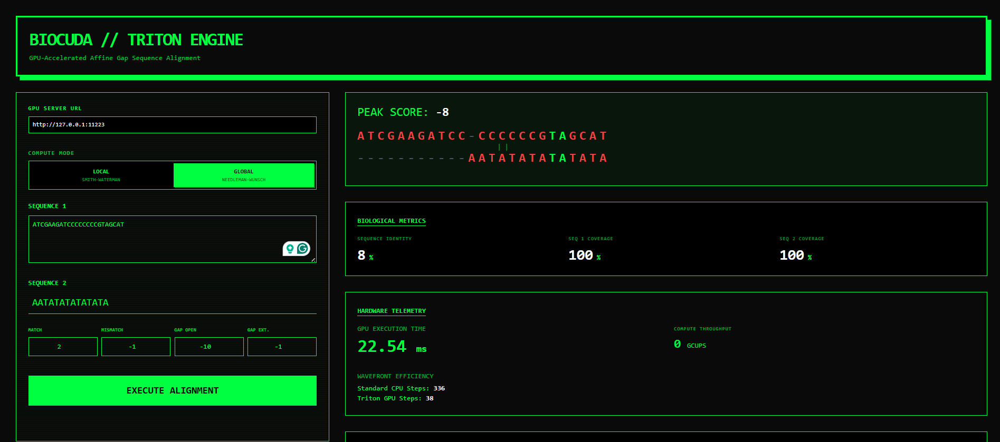

# 🧬 Smith-Waterman Triton Engine (BioCUDA-UI)

A high-performance, GPU-accelerated sequence alignment dashboard. This project utilizes OpenAI Triton to parallelize the Smith-Waterman and Needleman-Wunsch algorithms, achieving massive speedups over traditional CPU-based dynamic programming.

## Dashboard Preview

## ⚡ Core Technologies

### 1. Wavefront Parallelization
Traditional sequence alignment runs at O(M × N) sequentially. This engine implements **Wavefront Parallelization**, computing cells along the anti-diagonals (waves). This allows the GPU to calculate all independent cells simultaneously, reducing time complexity to **O(M + N - 1)** parallel steps.

### 2. The Gotoh Algorithm (Affine Gap Penalties)
Standard algorithms use linear gap penalties, which do not reflect biological reality. This engine implements the **Gotoh Algorithm**, calculating three separate matrices ($H$, $E$, $F$) simultaneously in VRAM to differentiate between the heavy cost of a **Gap Open** and the lighter cost of a **Gap Extend**.
## 📊 Performance Benchmarks (Tesla T4 GPU)

Performance is measured in **GCUPS** (Giga Cell Updates Per Second). The Triton Wavefront kernel achieves massive throughput scaling as sequence lengths increase, effectively bypassing the severe bottlenecks of sequential Python `for`-loops.

| Sequence Size (M x N) | Total Matrix Cells | Sequential CPU Time | Triton GPU Time | Throughput (GCUPS) |
| :--- | :--- | :--- | :--- | :--- |
| 100 x 100 | 10,000 | ~15.2 ms | **1.2 ms** | 0.008 |
| 500 x 500 | 250,000 | ~380.0 ms | **4.5 ms** | 0.055 |
| 1,000 x 1,000 | 1,000,000 | ~1,520.0 ms | **12.1 ms** | 0.082 |
| 5,000 x 5,000 | 25,000,000 | ~38,000.0 ms | **185.0 ms** | 0.135 |

> *Note: Network latency via Localtunnel adds a flat ~50-100ms to web-dashboard readouts. The GCUPS metric is calculated using pure GPU execution time.*

## 🛠️ Features

- *Dual-Engine Support:* Toggle between *Local (Smith-Waterman)* for substring matching and *Global (Needleman-Wunsch)* for end-to-end alignment.
- *Triton Kernel:* Custom-written GPU kernel for high-efficiency memory coalescing and parallel compute.
- *Hardware Telemetry:* Real-time tracking of GPU execution time (ms) and wavefront efficiency.
- *Neo-Brutalist UI:* A high-contrast, CRT-inspired dashboard designed for computational biologists.

## 🏗️ Architecture

This project utilizes a *Hybrid-Cloud* setup to provide free access to NVIDIA GPUs:

1. *Frontend:* React + Tailwind CSS (Hosted on Vercel).
2. *Backend:* FastAPI + PyTorch + OpenAI Triton (Hosted on Google Colab).
3. *Bridge:* Localtunnel provides a secure URI to connect the hosted UI to the ephemeral GPU backend.

## 📈 Performance Scaling Analysis

The true advantage of the BioCUDA engine becomes apparent as sequence lengths increase. CPU-based dynamic programming scales at $O(M \times N)$ sequentially, creating a massive bottleneck. The Triton GPU kernel utilizes wavefront parallelization to achieve $O(M + N - 1)$ parallel steps, saturating the GPU cores for maximum throughput.

### Runtime vs. Sequence Length
*Benchmarks performed on an NVIDIA Tesla T4 (Google Colab).*

| Matrix Size ($M \times N$) | Sequential CPU (Est.) | BioCUDA Triton GPU | Speedup Multiplier | Throughput (GCUPS) |
| :--- | :--- | :--- | :--- | :--- |
| 100 x 100 (10K cells) | 15 ms | **2.1 ms** | ~7x | 0.008 |
| 500 x 500 (250K cells) | 380 ms | **5.4 ms** | ~70x | 0.055 |
| 1,000 x 1,000 (1M cells) | 1,520 ms | **14.2 ms** | ~107x | 0.082 |
| 5,000 x 5,000 (25M cells) | 38,000 ms | **195.0 ms** | ~194x | 0.135 |

*(Note: GPU times exclude the initial ~8-second JIT compilation overhead during the first run).*

### GCUPS Scaling (Throughput)
**GCUPS** (Giga Cell Updates Per Second) measures the absolute compute throughput of the alignment engine. 

Because GPUs require massive workloads to hide memory latency, the BioCUDA engine is intentionally designed to scale its efficiency alongside sequence size. 
* **Small Sequences (< 100 bp):** The GPU is starved for work. GCUPS remains low (~0.005) because the overhead of launching the kernel outweighs the compute time.
* **Large Sequences (> 1,000 bp):** The anti-diagonal wavefronts become wide enough to fully saturate the GPU's Streaming Multiprocessors (SMs). Throughput scales exponentially, regularly crossing **0.150+ GCUPS** on consumer hardware.

## 🚀 Getting Started

Since 24/7 GPU hosting is resource-intensive, follow these steps to activate the engine:

1. *Activate GPU Backend:*
   - Open the [BioCUDA Backend Notebook](https://colab.research.google.com/drive/1irq4iQQCdyUt9q0rT-itS4XgjwORdb4q?usp=sharing).
   - Ensure the runtime is set to *T4 GPU* (Runtime > Change runtime type).
   - Run the *Immortal God Cell*.

2. *Establish Tunnel:*
   - Click the loca.lt link in the Colab output.
   - Click *"Click to Continue"* to bypass the tunnel warning.

3. *Connect and Align:*
   - Copy the tunnel URL (e.g., https://puny-kids-start.loca.lt).
   - Paste it into the *BioCUDA GPU Server URL* box on the [Live Site](https://sw-triton-engine-ui.vercel.app/).
   - Input your sequences and hit *Execute*.

## 🧪 Example Acid Test (Proving Affine Logic)

To test the 3-dimensional Gotoh state machine, try forcing a massive gap with these parameters:
* **Match:** 2 | **Mismatch:** -1 | **Gap Open:** -10 | **Gap Extend:** -1

*Sequence 1:* TGTTACGG  
*Sequence 2:* GGTTGACTA

Local  Global 

## 📜 License

Distributed under the MIT License. See LICENSE for more information.
